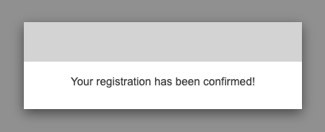

# Authentication and Authorization

Authorization in Booster is done through roles. Every Command (and in the future, every ReadModel)
has an `authorize` policy that tells Booster who can execute or access it. The policy is specified in the
`@Command` decorator and consists of one of the following two values:

- `'all'`: Meaning that the command is public: any user, both authenticated and anonymous, can execute it.
- An array of authorized roles `[Role1, Role2, ...]`: This means that only those authenticated users that
  have any of the roles listed there are authorized to execute the command

For example, the following command can be executed by anyone:

```typescript
@Command({
  authorize: 'all',
})
export class CreateComment {
  ...
}
```

While this one can be executed by authenticated users that have the role `Admin` or `User`:

```typescript
@Command({
  authorize: [Admin, User],
})
export class UpdateUser {
  ...
}
```

By default, a Booster application has no roles defined, so the only allowed value you can use in the `authorize` policy is `'all'` (good for public APIs).
If you want to add user authorization, you first need to create the roles that are suitable for your application.
Roles are classes annotated with the `@Role` decorator, where you can specify some attributes.

This is an example of a definition of two roles:

```typescript
@Role({
  allowSelfSignUp: false,
})
export class Admin {}

@Role({
  allowSelfSignUp: true,
})
export class User {}
```

Here, we have defined the `Admin` and `User` roles. The former contains the following attribute `allowSelfSignUp: false`,
which means that when users sign-up, they can't specify the role `Admin` as one of its roles.
The latter has this attribute set to `true`, which means that any user can self-assign the role `User` when signing up.

If your Booster application has roles defined, an authentication API will be provisioned. It will allow your users to gain
access to your resources.

This API consists of three endpoints ([see the API documentation](_09-rest-api.md)):

- `/auth/sign-up`: Users can use this endpoint to register in your application and get some roles assigned to them.
  Only roles with the attribute `allowSelfSignUp: true` can be specified upon sign-up. After calling this endpoint, the
  registration is not yet finished. Users need to confirm their emails by clicking in the link that will be sent to their
  inbox.

 
- `/auth/sign-in`: This endpoint creates a session for an already registered user, returning an access token that
  can be used to access role-protected resources (like Commands)
- `/auth/sign-out`: Users can call this endpoint to finish the session.


Once a user has an access token, it can be included in any request made to your Booster application as a
Bearer Authorization header (`Authorization: Bearer`). It will be used to get the user information and
authorize it to access protected resources.

Continue reading about [how to deploy your application](_08-deployment.md)
